# Open-VPN: Instalação no Linux

## Tutorial de instalação da Open-VPN no Linux

O cliente OpenVPN dá acesso à rede interna do LEDS. A rede interna
hospeda serviços que só podem ser acessados por meio da VPN.

Como conseguir acesso?

-   Se já nâo possuir o bundle de acesso (geralmente um .zip do OpenVPN,
    juntamente com seu user e password), solicite-o ao SysAdmin.
-   Com o bundle em mãos, vá até a pasta em que foi baixado o arquivo
    .zip pode ser por meio do terminal ou pela GUI mesmo e descompacte
    os arquivos.

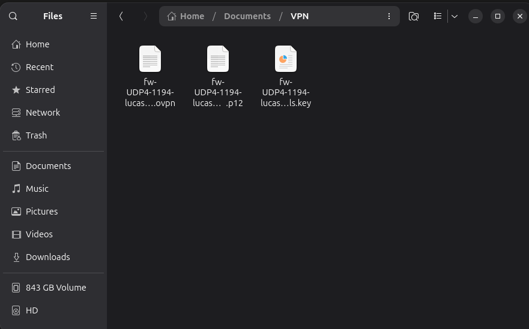
    
    **Após descompactar, deverá ter algo parecido com isso**.

** **    

-  Vá ao menu de opções do teu desktop/notebook.

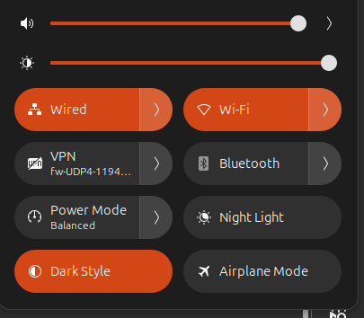

 ***Clique na seta em "Wired".***
**    **
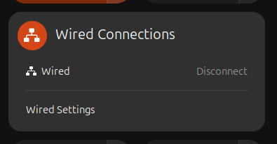 

***Clique em "Wired Settings".***

**    **
-   Neste menu, em VPN tu irá clicar no ícone "+". (Obs: Caso esteja
    pelo "Wi-Fi", clique na opção "All Networks" e vá até "Network").
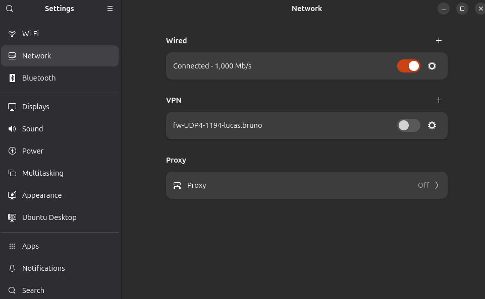
**    **

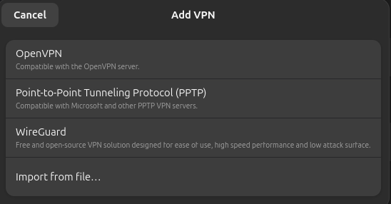

***Clique em "Import from file...".***

**    **

-   Caso tenha sucesso, abrirá o menu de configuração da "VPN".

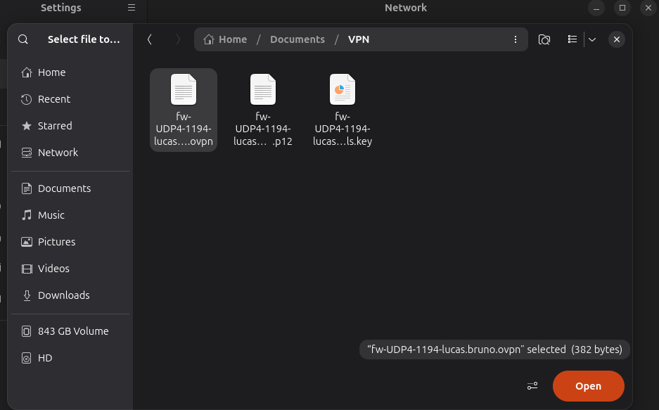

***Na pasta desejada, selecione o arquivo ".ovpn", depois clique em
"Open".***

** **
-   Em "Identity", irá de alterar apenas a opção "User private key".

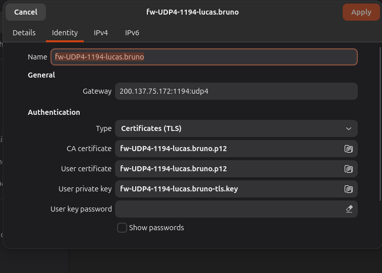
** **
- Em "User key password", deixar a última opção marcada. 
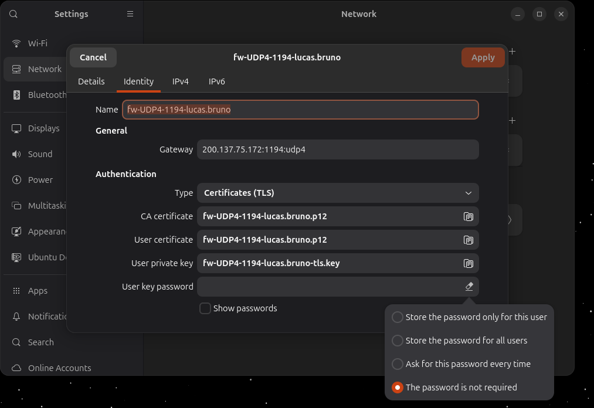
***Marcar "The password is not required"***
** **
- Após isso, vá até "IPv4".

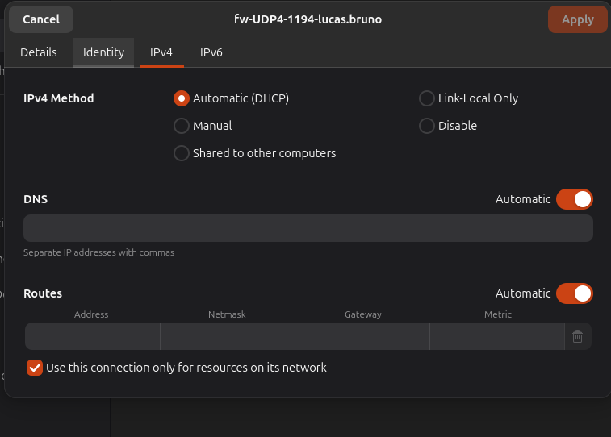

***Marque a opção "Use this connection only..."***

-   Clique em aplicar e então terá sua "VPN" instalada e pronta para
    uso!
** **

Para testar se o acesso foi validado e para trocar a sua senha de
usuário, é de ****SUMA IMPORTÂNCIA**** criar uma nova senha segura na
interface do firewall. Siga estes passos:

-   Acesse ****fw.intranet.leds.dev.br****. Se tudo deu certo, você estará na interface. Se ocorreu algum erro de rede, muito provavelmente sua VPN foi configurada de forma errada. Solicite ajuda para o SysAdmin.
  
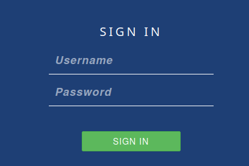

***Landing page do firewall.***

**    ** 

-   Se tudo deu certo, você estará na tela de trocar a senha. Caso dê algum erro de permissão, peça ajuda ao "SysAdmin".**
-   **Troque sua senha e salve.**

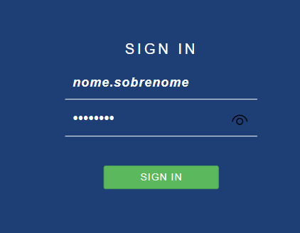
** **

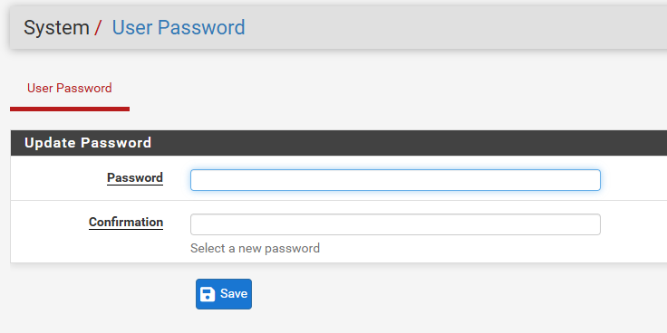

**_Insira seus dados e clique em "Save"._**  
                                              
                                        

  
Pronto! Seu acesso foi validado!

    

# Observações!

  Para evitar enventuais entraves, verifique se suas dependências do
linux estão atualizadas e baixadas. Indico também baixar e instalar o
"Openvpn", por meio do comando ******"sudo apt-get update && sudo
apt-get install openvpn"****** .